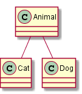
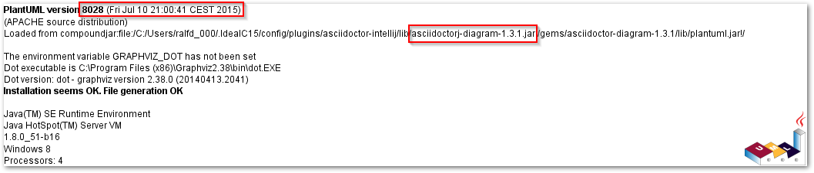

[Graphviz](http://www.graphviz.org) is cool to render diagrams and [PlantUML](https://plantuml.com) depends on Graphviz. But Graphviz is also a command line tool which needs to be installed. You can run it as portable app, but what if your company does not allow you to install Graphviz? What if you want to distribute your build but don't want to ask your users to install an additional package?

Since [April 2016](http://plantuml.com/smetana02.html), PlantUML supports rendering of diagrams without Graphviz. It is still in alpha but already working quite nice. The only drawback I currently notice is that it does not render arrow heads - something I can work with for the time being :-)

So just add

    !pragma graphviz_dot jdot
    
at top of your diagram and it will be rendered through jdot and not Graphviz dot. Just like this:

    [plantuml,jdot,png]
    ----
    !pragma graphviz_dot jdot
    class Animal
    class Cat
    class Dog
    Animal <|-- Cat
    Animal <|-- Dog
    ----

  

In order to make this work with the docToolchain project, the used version of asciidoctor-diagram had to be updated to 1.5.1 - this version includes the newest plantUML.

If you experience problems, you can always use the `version` statement of plantUML to check which version from which folder is used:

    [plantuml,version,png]
    ----
    version
    ----
    

  
 

In my case, I used the [asciidoctor-intellij-plugin](https://github.com/asciidoctor/asciidoctor-intellij-plugin) plugin to edit my AsciiDoc files. THis plugin rendered the images to the `images` folder within the `src` folder. The result was that the Gradle build copied the images created by the IntelliJ plugins over the generated one.

BTW: Thanx to [Alexander Schwartz](https://twitter.com/ahus1de) there is a [preview version](https://github.com/asciidoctor/asciidoctor-intellij-plugin/releases/tag/0.13-preview1) of the asciidoctor-intellij-plugin available which is able to work without Graphviz. And in addition, it renders the text and preview side-by-side!

PS: as always, the current version of docToolchain is available on github: [https://github.com/rdmueller/docToolchain](https://github.com/rdmueller/docToolchain/tree/d090eb8b1e38cf044599e884236e0aff9effca9c)

