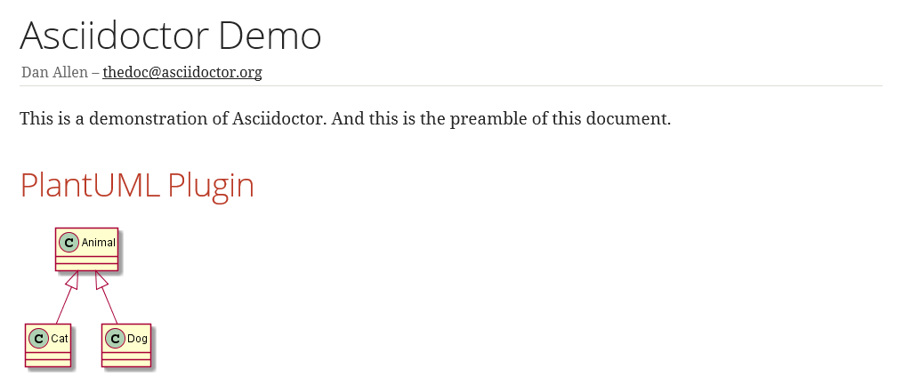

Let's add [PlantUML](https://plantuml.com) to our maven build. I'll use a slightly different approach. For the gradle build, I referenced the asciidoctor-diagram ruby gem to be used. But there is also a .jar version of it which can be used. It is one minor version behind the ruby gem, but that doesn't matter in this case.

First, let's clean up the build a bit. I've added a name and description for the project at the top of the file

    <name>docToolchain</name>
    <description>an example project on how to create agile documentation</description>

and also added a properties section where I define the dependency versions used in the rest of the build

    <properties>
        <project.build.sourceEncoding>UTF-8</project.build.sourceEncoding>
        <asciidoctor.maven.plugin.version>1.5.3</asciidoctor.maven.plugin.version>
        <asciidoctorj.diagram.version>1.5.0</asciidoctorj.diagram.version>
    </properties>

That makes it a bit easier to get an overview and to update versions later.

Now let's add the right dependency and configure the asciidoctor maven plugin:

    <dependencies>
        <dependency>
            <groupId>org.asciidoctor</groupId>
            <artifactId>asciidoctorj-diagram</artifactId>
            <version>${asciidoctorj.diagram.version}</version>
        </dependency>
    </dependencies>
    <configuration>
        [...]
        <requires>
            <require>asciidoctor-diagram</require>
        </requires>
    </configuration>

et voilá, we have the same result as with the gradle build :-)

  

The versions are already set is such a way that you can switch between the Graphviz dot version and the build in alpha of jdot.

The updated docTool project can be found here:  [https://github.com/rdmueller/docToolchain](https://github.com/rdmueller/docToolchain/tree/0c51e469da884af0632721996a2d2eb010f73cca)
