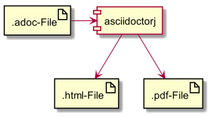

[Last time](https://rdmueller.github.io/why_no_word/) I wrote about why I don't like  Word, but I didn't mention an alternative.

For me, AsciiDoc as markup format is a perfect alternative for technical documents. Together with the tooling provided by the AsciiDoctorJ community it fulfills all my requirements.

AsciiDoc is a plain text format and thus just stores the information you want to document. The text will contain - besides tables - no layout. The layout is created by whatever renderer you chose. Since you don't have to worry about the layout, it also will not distract you. No "argh - how do I get this paragraph together with the diagram on one page?"!

And since it is plain text, you can happily store it along with the source code of your project. This not only solves versioning problems. You can now apply version control, "code"-review and diffs the same way you are used to do with your code. 

It also solves the first problem of any information architecture: Where are documents stored?

Now, let's take a look at the extra features AsciiDoc provides over real plain text.

## [Images are referenced and not embedded](http://asciidoctor.org/docs/asciidoc-syntax-quick-reference/#images):

```
image::sunset.jpg[] 
image::sunset.jpg[Sunset] 
[[img-sunset]] 
image::sunset.jpg[caption="Figure 1: ", title="A mountain sunset", alt="Sunset", width="300", height="200", link="http://www.flickr.com/photos/javh/5448336655"] 
image::http://asciidoctor.org/images/octocat.jpg[GitHub mascot]
```

This opens up new possibilities when you want to keep your documents up to date. No more "someone should update this diagram, but where is the source?" and "I will do it later, it's too much effort now". The document will reference the image and the source of the image (UML Model, Powerpoint etc.) will be in the same location or at least referenced from the build of your documentation. Yes - build - because no body likes to read plain asciidoc, you will have to render it to a more suitable output format. This is best done with the build tools you already know: maven or gradle. And this adds the new possibilities: you take the source file of your diagrams, images, slides etc. and extract the images just before the document gets rendered. This way you only have to update the source, not the document.

BTW: that's part two of an information architecture - you not only know where your documents are stored, you also reference the location of external sources for images.

## Plugins extend the capabilities of AsciiDoc

The plugin I like most is the [PlantUML](http://www.plantuml.com) plugin. When installed, you can describe UML diagrams in plain text and it will be rendered with the document. The magic is the same as with AsciiDoc - you don't have to care about the layout. PlantUML will render the boxes for you. This does not always make sense, but for certain types of diagrams it is better than any other tool.

For instance when it comes to sequence diagrams - you don't want to layout them manually and PlantUML does a really good job for sequence diagrams.

Here is an example for PlantUML inside AsciiDoc:

```
[plantuml,"demo",png]
--
artifact ".adoc-File" as adoc
artifact ".html-File" as html
artifact ".pdf-File" as pdf
component asciidoctorj
adoc -> asciidoctorj 
asciidoctorj -down-> html
asciidoctorj -down-> pdf
--
```
<div style="text-align: center;">

</div>

## Subdocuments can be referenced

Just put all your chapters in subdocuments and create a master which includes them for the rendering of the whole document. This makes it easier to handle you text. And if you need different compositions for different stakeholders, just create additional "master" documents which rearrange, leave out or even add new chapters.

```
include::Chapter_01.adoc[]
include::Chapter_02.adoc[]
include::Chapter_03.adoc[]
```

## Conclusion / tl;dr

These are only a few reasons why I favour Asciidoc over MS Word. The main reason is that it looks like code, feels like code, can be controlled like code and builds like code. And that's what counts :-)

If you need more arguments, check out the great blogposts by [@mrhaki](https://twitter.com/mrhaki): [Awesome:Asciidoctor](http://mrhaki.blogspot.de/search/label/Awesome%3AAsciidoctor)
