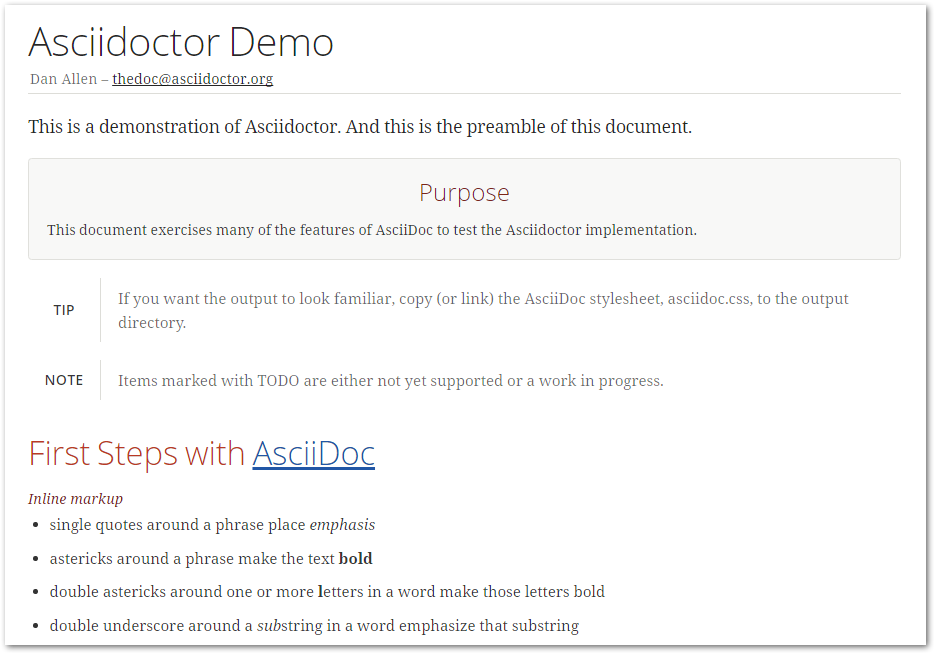

[Last time](https://rdmueller.github.io/gradle_asciidoc_build/) we created a Gradle project to render an AsciiDoc file. But what if you can't use Gradle but have to use Maven? 

Let's add a `pom.xml` to turn the project into a Maven project!

## Maven Integration

Again - if you don't have Maven already installed, use [SDKMan](http://sdkman.io) or [posh-GVM](https://github.com/flofreud/posh-gvm) to download and install it.

I assume that you already have a command line open and your working directory is the project we created last time.

For Maven, there is also a [wrapper](https://github.com/takari/maven-wrapper) which acts like the Gradle wrapper. To make our project more convenient, let's first install the wrapper:

``` bash
mvn -N io.takari:maven:wrapper
``` 

Now, maven needs a `pom.xml` file and unfortunately, it is not as simple as the `build.gradle` file. I googled a bit and this is what I came up with:

``` xml
<project xmlns="http://maven.apache.org/POM/4.0.0" xmlns:xsi="http://www.w3.org/2001/XMLSchema-instance" xsi:schemaLocation="http://maven.apache.org/POM/4.0.0 http://maven.apache.org/xsd/maven-4.0.0.xsd">
	<modelVersion>4.0.0</modelVersion>
	<groupId>com.mycompany.doc</groupId>
	<artifactId>asciidocTest</artifactId>
	<version>0.1</version>

	<build>
		<!-- (1) makes it easier to run build -->
		<defaultGoal>generate-resources</defaultGoal>
		<plugins>
			<plugin>
				<groupId>org.asciidoctor</groupId>
				<artifactId>asciidoctor-maven-plugin</artifactId>
				<version>1.5.3</version>
				<configuration>
					<!-- (2) defaults to src/main/asciidoc -->
					<sourceDirectory>src/docs/asciidoc</sourceDirectory>
					<!-- (3) defaults to docbook -->
					<backend>html5</backend>
					<!-- (4) defaults to target/generated-docs -->
					<outputDirectory>build/docs/html5</outputDirectory>
				</configuration>
				<executions>
					<execution>
						<id>output-html</id>
						<phase>generate-resources</phase>
						<goals>
							<goal>process-asciidoc</goal>
						</goals>
					</execution>
				</executions>
			</plugin>
		</plugins>
	</build>
</project>
``` 

It is not the simplest build file for rendering AsciiDoc, but I wanted configure it so that it does the same as the Gradle build:

* (1) set a default build target so that you don't have to specify one when you run maven
* (2)/(4) change the source and output directories to be the same as with the Gradle build
* (3) somehow the renderer defaults to the docbook backend (I seems to ignore the backend defined in the `test.asciidoc` file). So I configured the html5 backend directly in `the pom.xml`.

That's it! Just run

``` bash
mvnw
``` 

and you'll get the same output as with the Gradle build:

<div>  </div>

## Conclusion

It doesn't matter if you use Maven or Gradle as build tool. You can unleash the power of AsciiDoc with both build system. You can even use it without a build system by directly using AsciiDoctor as library from Groovy or Java.

PS: the docToolchain project greated above is available on github: [https://github.com/rdmueller/docToolchain](https://github.com/rdmueller/docToolchain/tree/e68bf3e039f52ba346626a0da8e2082e29390021)
