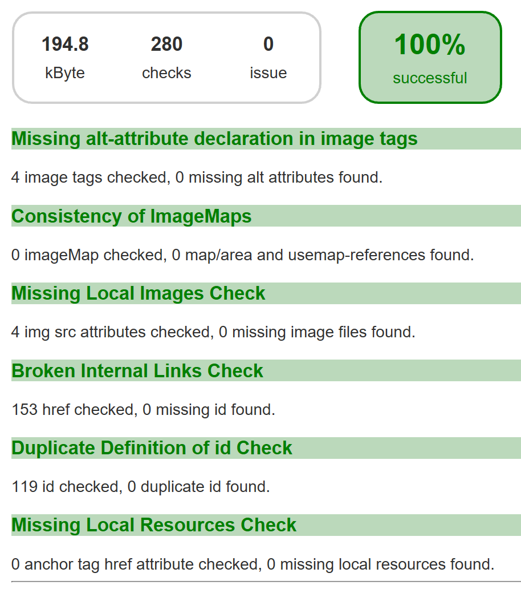

Now that docToolchain handles your docs like your code, the next logical step is to add some automated tests.

That's where [htmlSanityCheck](https://github.com/aim42/htmlSanityCheck), a project originally started by [Gernot Starke](https://twitter.com/gernotstarke) fits:

It is a gradle plugin which does some quality checks on a generated HTML document.
Since it is well documented, I will not waste your time by writing something which is already written on the project page.

The htmlSanityCheck is now the last default task for docToolchain and creates a report which looks like this:

As always, the updated code is already on github: [docToolchain](https://github.com/rdmueller/docToolchain)
