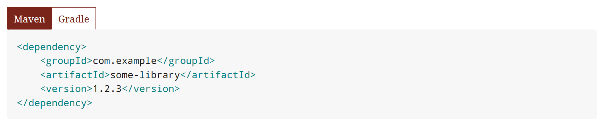

While writing a tutorial, I just came across the need to target two different user groups - windows and linux users.
I wanted to write some shell commands as example but didn't know if I should use powershell examples or better go withbash.
Both examples would be a good solution, but it wouldn't be nice to always have to skip half of them.

Haven't I seen tabbed code blocks somewhere in documentation? 

I remembered that I read about an asciidoctor plugin written by the spring team. 
Google soon revealed a [stackoverflow](https://stackoverflow.com/questions/38211766/using-tabs-in-asciidoc-spring-rest-docs) question as the best result.
This then led me to the plugin itself: [spring-boot-asciidoctor-extensions](https://github.com/spring-io/spring-asciidoctor-extensions).

Used the right way, it produces beautiful looking tabs for your code-blocks:

I was tempted to show you here how to use the extensions, but then reminded myself that it would be better to add the details I was missing from the readme when I first tried to use it, to the readme itself.

So head over to [spring-boot-asciidoctor-extensions](https://github.com/spring-io/spring-asciidoctor-extensions) and give it a try!

PS: as with most of those extensions which make use of HTML, CSS and JavaScript, they are ignored by all output formats which are not HTML based. 
So if you want to generate for example PDF, your code blocks will be rendered as separrate blocks.

PSPS: yes, you can use more than two tabs. Just add additional "secondary" blocks.