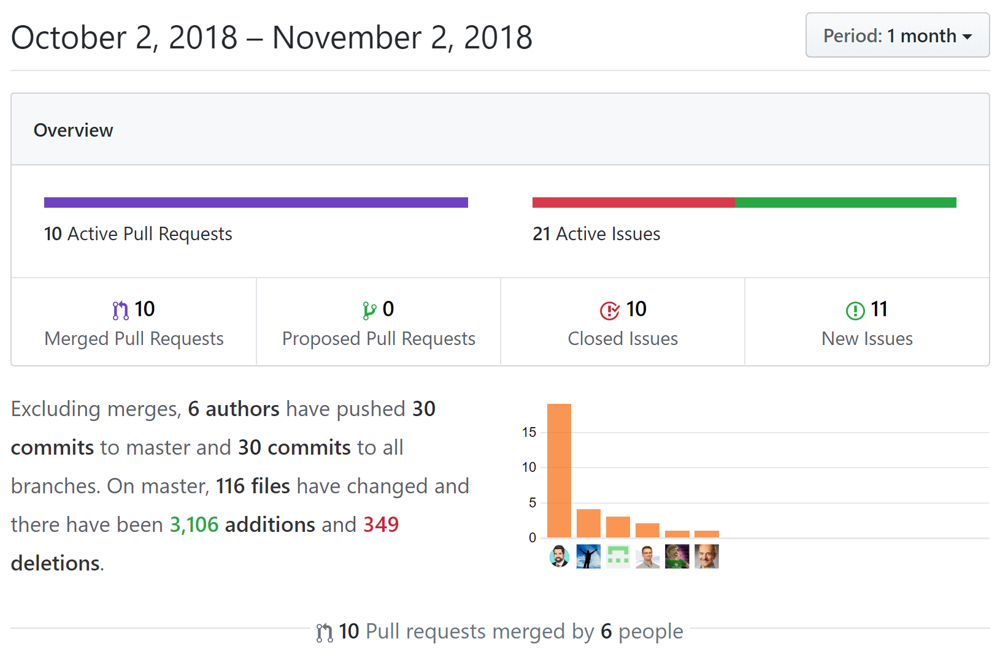

[Hacktoberfest](https://hacktoberfest.digitalocean.com) turned october into the most productive month of the last year in regards to [docToolchain](https://docToolchain.github.io/docToolchain):

Not only did we reach my goal of 10 pull requests for [docToolchain](https://docToolchain.github.io/docToolchain), Hacktoberfest also added new features and new contributors to [docToolchain](https://docToolchain.github.io/docToolchain)!!

As promised, I just donated 5€ for each PR to the [movember foundation](https://movember.com/) and i doubled the amount to make it 100€.

Thanx for supporting docToolchain and the movember foundation with your PRs!

